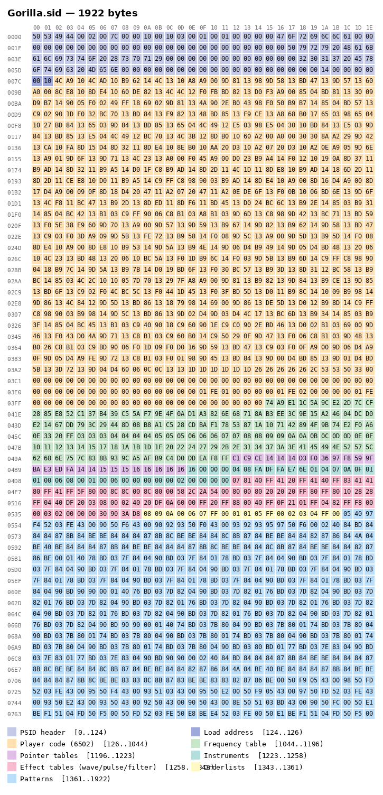

# The SIDfinity Project

Could we get AI to generate C64 SID music? That is the basic premise of this project that started late March 2026 as a hobby project. Figuring out what this premise is supposed to mean, and how to approach it, has been the main focus so far. I have not been able to keep the README in sync with the state of the project because of many frequent fundamental changes to the repo. I encourage you to use your favorite tool to look at the git history. So, I've decided to only put stuff in the README that I feel more or less confidently is going to stay.

## Introduction

The [High Voltage SID Collection](https://www.hvsc.c64.org/) contains over 60000 SID-files. Each of these files contain 6502 machine code + data that is executed in a Commodore 64 environment, producing an audio signal. One possible approach would be to do ML on this signal. I find this approach boring, and has not been in my scope at all. I'd rather try to do ML on the SID files themselves.

## SID files

Let us look at an example SID file. It's Gorilla by Pyry Hakalisto (2017).

 

## License

MIT for the SIDfinity code; some bundled components carry their own licenses (GPL, and third-party C64 material kept for preservation). See [LICENSE](LICENSE) for the full breakdown.
